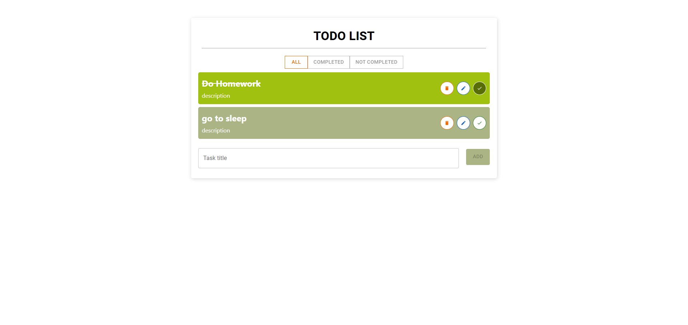

# Todo List Project

[Demo](https://ayoubmajid67.github.io/ReactProjects/project1/build/index.html)

 

This is a simple Todo List application built with React that allows users to manage their tasks efficiently. The app includes features for adding, deleting, updating, and completing tasks, as well as filtering tasks based on their completion status. Local storage is used to save todos, ensuring that your tasks persist even after refreshing the page. Material-UI is integrated for a clean and modern user interface.

## Features

- **Add Tasks**: Easily add new tasks to your todo list.
- **Delete Tasks**: Remove tasks that are no longer needed.
- **Update Tasks**: Modify existing tasks to keep your list up to date.
- **Complete Tasks**: Mark tasks as completed to track your progress.
- **Filter Tasks**: View tasks based on their status:
  - **All**: Show all tasks.
  - **Completed**: Show only completed tasks.
  - **Not Completed**: Show only tasks that are still pending.

## Technologies Used

- **React**: The main framework for building the application.
- **Material-UI**: A popular React UI framework for styling components.
- **Local Storage**: Used for storing todos, ensuring persistence across sessions.

## Usage

Once the application is running, you can:

1. Add new tasks using the input field.
2. Click the "Complete" button next to a task to mark it as completed.
3. Use the "Delete" button to remove tasks from the list.
4. Update tasks by clicking on them, editing the text, and saving the changes.
5. Filter tasks using the provided options to view all, completed, or not completed tasks.

## Contact

For any inquiries or feedback, feel free to reach out:

- **Email**: your-email@example.com
- **LinkedIn**: [LinkedIn Profile](https://www.linkedin.com/in/yourprofile/)

