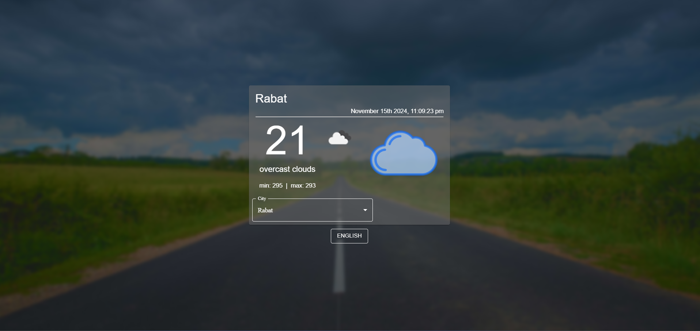

# Weather App Project

[Demo](https://ayoubmajid67.github.io/ReactProjects/project2/build/index.html)

This Weather App provides users with real-time weather information for cities in Morocco. It includes features like displaying current temperature, weather conditions, and min/max temperatures. The app supports both Arabic and English languages, uses the OpenWeather API for weather data, and integrates location-based weather fetching.

## Features

- **Real-Time Weather**: View current weather information including temperature, weather conditions, and min/max temperatures.
- **Location-Based Weather**: Get weather data for your current location.
- **City Selection**: Select a city in Morocco to view its weather.
- **Multi-Language Support**: Switch between Arabic and English for the app interface.
- **Date Formatting**: Dates are displayed in a user-friendly format using Moment.js.

## Technologies Used

- **React**: The main framework for building the application.
- **Material-UI**: Provides a clean and modern UI design.
- **OpenWeather API**: Supplies real-time weather data for selected cities.
- **i18next**: Handles language localization to support English and Arabic.
- **Moment.js**: Used for date formatting to display current date and time.

## Contact

For any inquiries or feedback, feel free to reach out:

- **Email**: your-email@example.com
- **LinkedIn**: [LinkedIn Profile](https://www.linkedin.com/in/yourprofile/)

